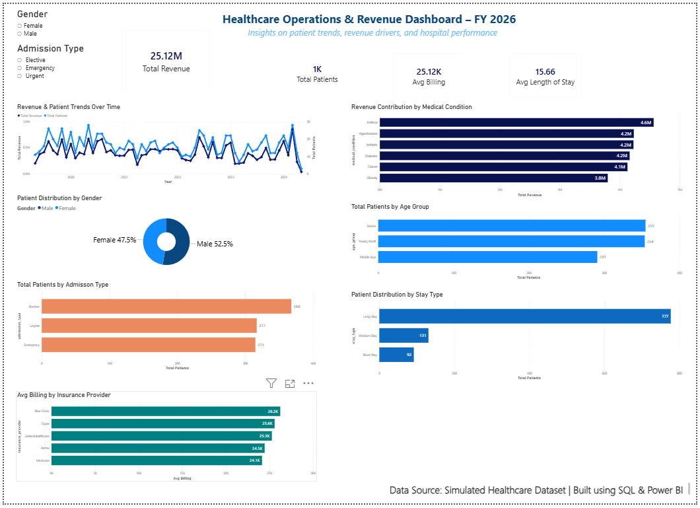
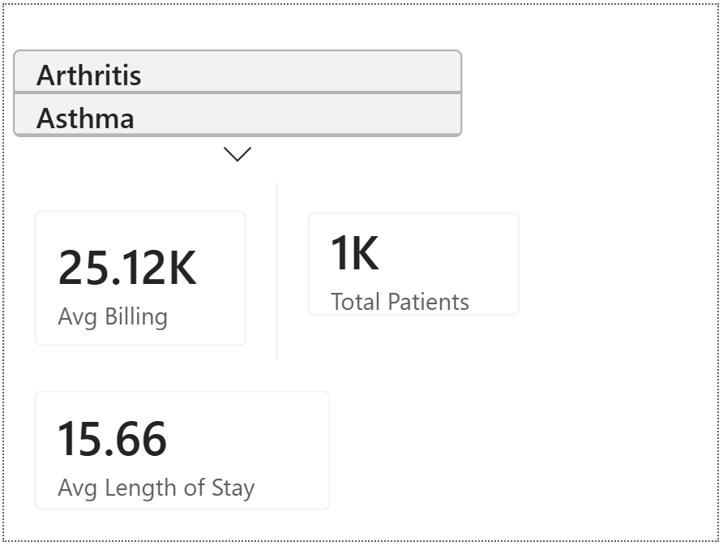

# 🏥 Healthcare Operations & Revenue Analytics Dashboard – FY 2026


---

# 🏥 Healthcare Operations & Revenue Analytics Dashboard – FY2026

<p align="center">

</p>

---

# 📌 Project Overview

This project analyzes healthcare operations and hospital revenue using **SQL** and **Power BI** to identify patient trends, revenue drivers, admission patterns, insurance performance, and operational efficiency.

The dashboard transforms raw healthcare records into interactive business intelligence, enabling hospitals and healthcare organizations to make informed decisions through visual analytics.

---

# 🎯 Business Objectives

- Analyze hospital revenue performance
- Monitor patient admission trends
- Evaluate average billing amounts
- Analyze patient demographics
- Identify top revenue-generating medical conditions
- Monitor average hospital stay
- Compare insurance provider performance
- Support data-driven healthcare decisions

---

# 📈 Dashboard KPIs

| KPI | Value |
|------|---------|
| 💰 Total Revenue | $25.12M |
| 👨‍⚕️ Total Patients | 1,000 |
| 💵 Average Billing | $25.12K |
| 🏥 Average Length of Stay | 15.66 Days |

---

# 📊 Dashboard Features

✔ Interactive Filters

✔ Gender Analysis

✔ Admission Type Analysis

✔ Revenue Trend Analysis

✔ Patient Trend Analysis

✔ Medical Condition Analysis

✔ Insurance Provider Analysis

✔ Stay Type Distribution

✔ Age Group Distribution

✔ Tooltip Page

---

# 🛠 Tools & Technologies

- Microsoft Excel
- MySQL
- SQL
- Power BI Desktop
- DAX
- GitHub

---

# 📂 Dataset

The dataset contains simulated healthcare operational data including:

- Patient Demographics
- Medical Conditions
- Billing Amount
- Admission Type
- Insurance Provider
- Length of Stay
- Revenue
- Hospital Information

Dataset Size

- 1000 Records

---

# 🗄 SQL Analysis

Business questions answered using SQL include:

- Total Revenue
- Revenue by Medical Condition
- Revenue by Insurance Provider
- Monthly Revenue
- Admission Analysis
- Patient Distribution
- Stay Type Analysis
- Average Billing
- Gender Analysis

---

# 📐 DAX Measures

The dashboard includes custom DAX calculations:

- Total Revenue
- Total Patients
- Average Billing
- Average Length of Stay
- Revenue by Condition
- Revenue Trend
- Patient Distribution

---

# 📊 Dashboard Visualizations

The dashboard contains:

- Revenue Trend Over Time
- Revenue by Medical Condition
- Revenue by Insurance Provider
- Patient Distribution by Gender
- Patient Distribution by Admission Type
- Patient Distribution by Stay Type
- Patient Distribution by Age Group
- KPI Cards
- Interactive Slicers
- Tooltip Page

---

# 💡 Key Insights

- Asthma generated the highest hospital revenue.
- Male patients accounted for approximately 52.5% of admissions.
- Elective admissions represented the largest admission category.
- Long-stay patients formed the majority of hospital stays.
- Blue Cross showed the highest average patient billing.
- Average patient billing exceeded $25K.
- Average patient stay was approximately 15.66 days.

---

# 📌 Business Recommendations

- Improve operational planning for long-stay patients.
- Focus preventive care initiatives on high-revenue medical conditions.
- Optimize insurance claim processing.
- Monitor patient admission trends continuously.
- Utilize dashboard insights for hospital capacity planning.

---

# 📸 Dashboard Preview

## Main Dashboard

<p align="center">

</p>

---

## Tooltip Page

<p align="center">

</p>

---

# 🔄 Project Workflow

```
Raw Dataset
      │
      ▼
Excel Cleaning
      │
      ▼
MySQL Database
      │
      ▼
SQL Analysis
      │
      ▼
Power BI
      │
      ▼
Interactive Dashboard
      │
      ▼
Business Insights
```

---

# 📁 Repository Structure

```text
Healthcare-Analytics-Dashboard

│

├── Dataset
│ └── healthcare_final_dataset.csv

├── SQL
│ └── Healthcare_SQL_Queries.sql

├── PowerBI
│ └── Healthcare_Dashboard.pbix

├── Screenshots
│ ├── Dashboard.png
│ └── Tooltip.png

├── README.md

└── LICENSE
```

---

# 📂 Project Files

| File | Description |
|------|-------------|
| 📁 [Dataset](Dataset/healthcare_final_dataset.csv) | Cleaned Healthcare Dataset |
| 🗄 [SQL Queries](SQL/Healthcare_SQL_Queries.sql) | SQL Business Analysis |
| 📊 [Power BI Dashboard](PowerBI/Healthcare_Dashboard.pbix) | Interactive Dashboard |
| 🖼 [Dashboard Screenshot](Screenshots/Dashboard.png) | Dashboard Overview |
| 💬 [Tooltip Screenshot](Screenshots/Tooltip.png) | Tooltip Page |

---

# 🚀 Skills Demonstrated

- Data Cleaning
- SQL Query Writing
- Database Management
- Business Intelligence
- Dashboard Design
- KPI Development
- Data Visualization
- Healthcare Analytics
- Data Storytelling

---

# 🔗 Quick Access

📊 [Power BI Dashboard](PowerBI/Healthcare_Dashboard.pbix)

🗄 [SQL Queries](SQL/Healthcare_SQL_Queries.sql)

📁 [Dataset](Dataset/healthcare_final_dataset.csv)

---

# 👤 Author

**Naga Lakshmi Devanaboina**

M.Sc Biotechnology | Data Analytics Enthusiast

### Skills

- SQL
- Power BI
- Excel
- MySQL
- Tableau

GitHub

https://github.com/nagalakshmi-dnl

---

# 📜 License

This project is licensed under the MIT License.

---

# ⭐ If you found this project useful, consider giving it a Star!

It motivates me to build more Data Analytics projects and share them with the community.
